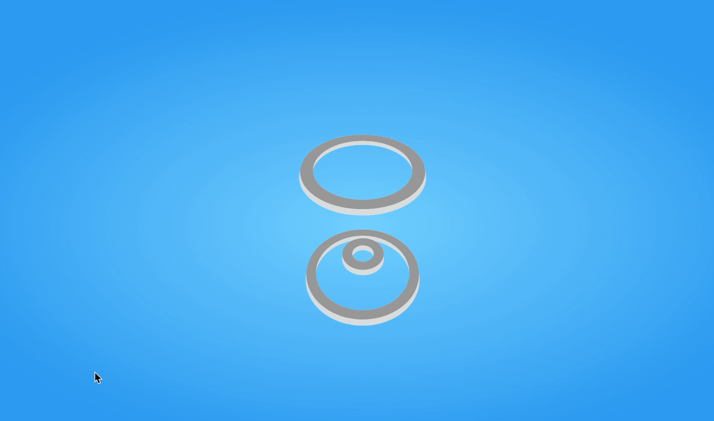

# css-animation-3d-loading

> **#flex** | **scss @for** | **scss @each** | **scss variables** | **animation @keyframes animate-circles** | **scss lists** | **@mixin transform-circle** | **transform: translateZ** | **background: radial-gradient** | **transform: perspective(500px) rotateX** | **@include transform-circle** | **box-shadow** | **box-sizing: border-box;**

# Demo

